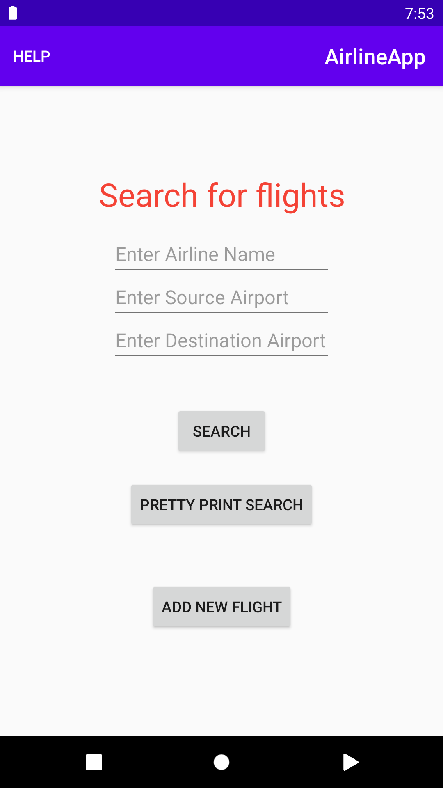

# Android-Airline-App
This App is an Android project about Airline. 
User can enter Airline and Flight information by clicking the Add Flight Button. 
User can search for flights given Airline name, (optional) source and destination.The user can use the Search Flight Button or Pretty Print Button (which pretty prints the output). 
The HELP option redirects to a README page. 

## Unit Testing
### Code Coverage: 91.6%
#### To Run: In Android Studio, select Run Tests with coverage
55 tests 
Used Robolectric framework to write unit tests *( http://robolectric.org/ )* 
Code Coverage Files Found under UnitTestCoverage

## Android Test (UI Test)
### Code Coverage: 94%
#### To Run: In Android Studio, select from gradle menu > reporting > combinedTestReportDebug. Before starting tests make sure App emulator is running. Files are found under app\build\reports\coverage\debug
51 tests 
Used Espresso framework to write UI tests. *(https://developer.android.com/training/testing/espresso)* 
Code Coverage Files Found under UITestCoverage

